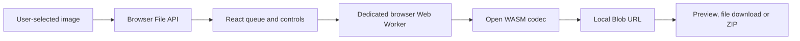

# ZeroByteMode architecture

## Product boundary

ZeroByteMode is a static browser application. Its deployable product boundary is the generated `out/` directory, hosted by GitHub Pages at `https://zerobytemode.com`.

There is no application server, account service, payment service, analytics service, database, image-upload endpoint, Cloudflare Worker or remote processing service.

## Runtime flow

All image bytes remain inside the browser process. The page passes `File` objects to `src/app/compressor.worker.ts`. The browser Web Worker selects or runs one of:

- MozJPEG through `@jsquash/jpeg`;
- OxiPNG through `@jsquash/oxipng`;
- libwebp through `@jsquash/webp`;
- libavif through `@jsquash/avif`;
- the browser's native canvas encoder as a fallback.

The browser Web Worker returns a `Blob`. The main thread creates an in-memory object URL for preview and download. ZIP archives are assembled locally with JSZip.

## State and privacy

Queue, settings and output URLs live only in React memory. The application does not write account cookies, local storage, session storage or IndexedDB. Reloading the page clears the current work.

GitHub Pages receives ordinary requests for the static HTML, JavaScript, CSS, images and WASM assets. It does not receive the user's selected image files, filenames, compression settings or generated outputs.

## Browser security controls

The document CSP:

- limits network connections to same-origin assets and local `blob:` objects;
- blocks forms and embedded objects;
- permits local Blob images and browser Web Workers;
- permits the WebAssembly execution required by the codecs;
- contains no analytics, email, payment or application-service origins.

Browser tests fail if account, checkout or external application requests appear.

## Deployment

`npm run build` creates `out/`. GitHub Actions validates that exact artifact with dependency audit, repository invariants, lint, TypeScript, browser checks and codec tests. The workflow then uploads `out/` with the official GitHub Pages artifact action and deploys it through the `github-pages` environment.

`public/CNAME` contains `zerobytemode.com` and is copied into the static output. No Wrangler file, Worker script, runtime secret or secondary deployment platform is required.

## Release history and recovery

Production changes are merged into `main` through ordinary pull requests. Recovery means restoring a known-good tree, rerunning the release gate and deploying the same `out/` artifact through GitHub Pages. There is no database migration, secret rotation or secondary application service to coordinate.
