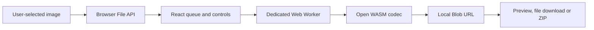

# ZeroByteMode architecture

## Product boundary

ZeroByteMode is a static browser application. Its product boundary is the generated `out/` directory, deployed to GitHub Pages.

There is no application server, account service, payment service, analytics service, database or image-upload endpoint.

## Runtime flow

All image bytes remain inside the browser process. The page passes `File` objects to `src/app/compressor.worker.ts`. The worker selects or runs one of:

- MozJPEG through `@jsquash/jpeg`;
- OxiPNG through `@jsquash/oxipng`;
- libwebp through `@jsquash/webp`;
- libavif through `@jsquash/avif`;
- the browser's native canvas encoder as a fallback.

The worker returns a `Blob`. The main thread creates an in-memory object URL for preview and download. ZIP archives are assembled locally with JSZip.

## State and privacy

Queue, settings and output URLs live only in React memory. The application does not write account cookies, local storage, session storage or IndexedDB. Reloading the page clears the current work.

GitHub Pages receives normal requests for HTML, JavaScript, CSS, images and WASM assets. It does not receive the user's selected image files.

## Browser security controls

The document CSP:

- limits network connections to same-origin assets and local `blob:` objects;
- blocks forms and embedded objects;
- permits local Blob images and workers;
- permits the WebAssembly execution required by the codecs;
- contains no analytics, email, payment or application-service origins.

GitHub Pages controls HTTP response headers. The application does not claim custom response-header protections that Pages cannot configure. Browser tests fail if account, checkout or external application requests return.

## Deployment

`npm run build` creates `out/`. GitHub Actions validates that exact artifact, uploads it with the official Pages artifact action and deploys it through the `github-pages` environment. `public/CNAME` supplies the custom domain in the generated artifact.

## Release history and recovery

The public repository is maintained as one parentless release commit on `main`. Before a history rewrite, the complete prior Git graph is exported to a time-limited Git bundle artifact. Recovery means restoring the required tree from that bundle, rerunning the release gate and publishing a new single root commit. There is no database migration, secret rotation or secondary application service to coordinate.
