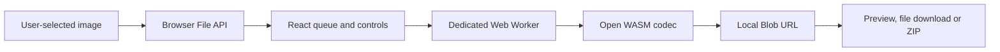

# ZeroByteMode architecture

## Product boundary

ZeroByteMode is a static browser application. Its product boundary is the generated `out/` directory. Any static file host can serve it.

There is no application server, account service, payment service, analytics service, database or image-upload endpoint.

## Runtime flow

All image bytes remain inside the browser process. The page passes `File` objects to `src/app/compressor.worker.ts`. The worker selects or runs one of:

- MozJPEG through `@jsquash/jpeg`;
- OxiPNG through `@jsquash/oxipng`;
- libwebp through `@jsquash/webp`;
- libavif through `@jsquash/avif`;
- the browser's native canvas encoder as a fallback.

The worker returns a `Blob`. The main thread creates an in-memory object URL for preview and download. ZIP archives are assembled locally with JSZip.

## State and privacy

Queue, settings and output URLs live only in React memory. The application does not write account cookies, local storage, session storage or IndexedDB. Reloading the page clears the current work.

Static hosting still sees normal requests for HTML, JavaScript, CSS, images and WASM assets. It does not receive the user's selected image files.

## Security controls

The document CSP:

- limits application connections to the same origin;
- blocks forms and frames;
- permits local Blob images and workers;
- permits the WebAssembly execution required by the codecs;
- contains no Stripe, analytics, email or Worker origins.

The source repository includes browser tests that fail if account, checkout or external application requests return.

## Deployment

`npm run build` creates `out/`. Deployment is a copy of that immutable directory to a static host. Cloudflare can host the files, but it is not part of the application architecture and no Cloudflare Worker is required.

## Recovery

The release unit is a Git commit and its generated static output. Roll back by rebuilding and redeploying the previous known-good commit. There is no database migration, secret rotation or secondary service to coordinate.
