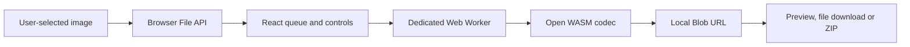

# ZeroByteMode architecture

## Product boundary

ZeroByteMode is a static browser application. Its deployable product boundary is the generated `out/` directory. The live custom domain is served as Cloudflare Workers Static Assets; GitHub Pages remains a separately validated fallback artifact.

There is no application server, account service, payment service, analytics service, database or image-upload endpoint.

## Runtime flow

All image bytes remain inside the browser process. The page passes `File` objects to `src/app/compressor.worker.ts`. The worker selects or runs one of:

- MozJPEG through `@jsquash/jpeg`;
- OxiPNG through `@jsquash/oxipng`;
- libwebp through `@jsquash/webp`;
- libavif through `@jsquash/avif`;
- the browser's native canvas encoder as a fallback.

The worker returns a `Blob`. The main thread creates an in-memory object URL for preview and download. ZIP archives are assembled locally with JSZip.

## State and privacy

Queue, settings and output URLs live only in React memory. The application does not write account cookies, local storage, session storage or IndexedDB. Reloading the page clears the current work.

Cloudflare receives normal requests for the static HTML, JavaScript, CSS, images and WASM assets. It does not receive the user's selected image files.

## Browser security controls

The document CSP:

- limits network connections to same-origin assets and local `blob:` objects;
- blocks forms and embedded objects;
- permits local Blob images and workers;
- permits the WebAssembly execution required by the codecs;
- contains no analytics, email, payment or application-service origins.

The production deployment contains no Worker runtime script: Cloudflare serves only the files from `out/`. Browser tests fail if account, checkout or external application requests return.

## Deployment

`npm run build` creates `out/`. Cloudflare Workers Builds runs the build and then deploys that directory through `wrangler.jsonc` using Workers Static Assets. The Wrangler project name must remain `zerobytemode` so it matches the connected Worker.

GitHub Actions independently validates the same static output with dependency audit, repository invariants, lint, TypeScript, browser tests and codec tests. It also publishes a GitHub Pages fallback artifact. `public/CNAME` is retained for that fallback and domain recovery path.

## Release history and recovery

Production changes are merged into `main` through ordinary pull requests so both GitHub validation and Cloudflare's Git integration receive normal repository events. Recovery means restoring a known-good tree, rerunning the release gate and redeploying the same `out/` artifact. There is no database migration, secret rotation or secondary application service to coordinate.
